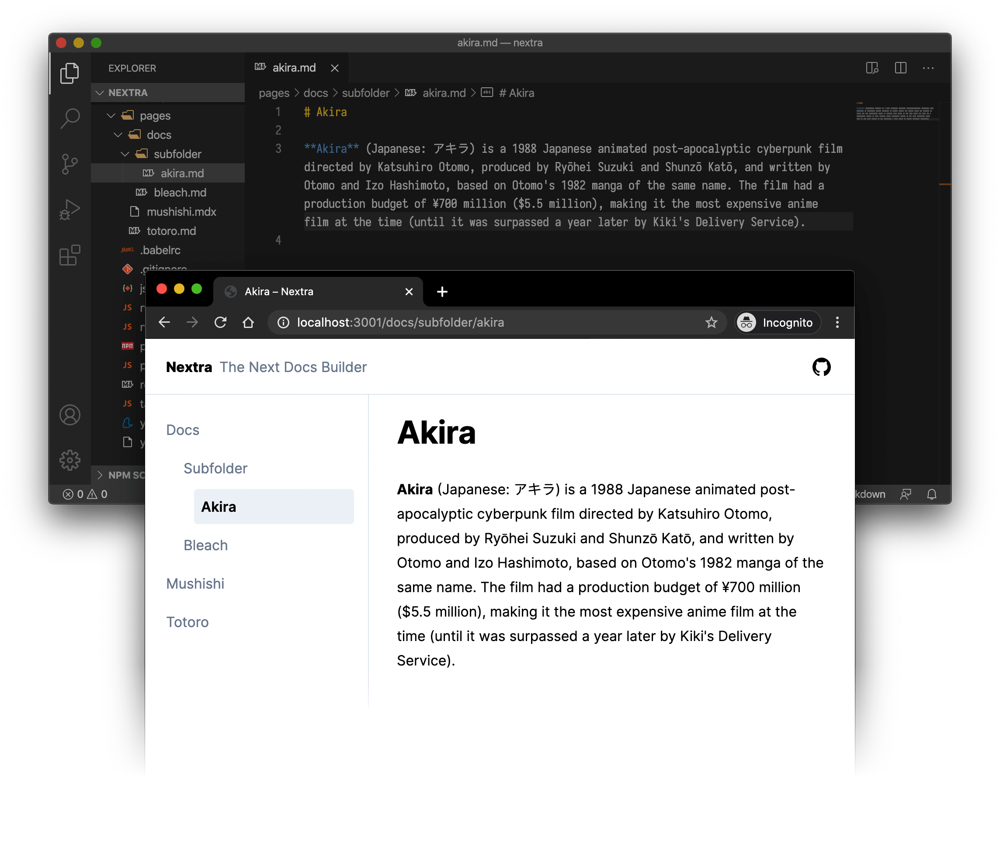

import Bleed from 'nextra-theme-docs/bleed'

# Vibra

**Vibra** is a [Next.js](https://nextjs.org) based static site generator.

It supports Markdown and React components ([MDX](/features/mdx)), automatically generated [sidebar and anchor links](/comenzar#sidebar-and-anchor-links), file-system based routing, built-in syntax highlighting, image optimization, custom layouts, i18n, and all the features you love about Next.js.

Here's what you will get in 1 minute:

<Bleed></Bleed>
